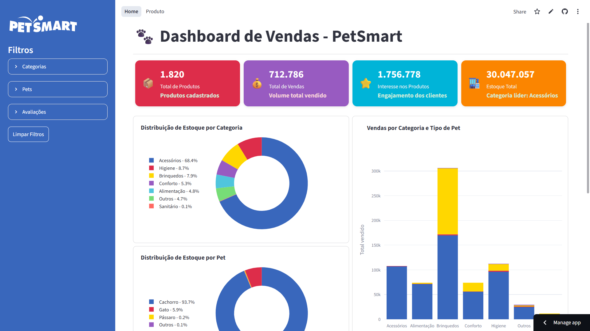
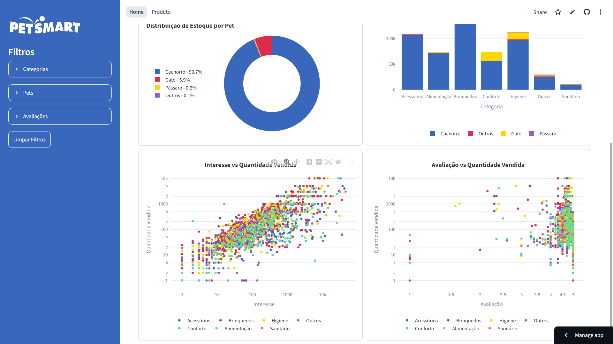
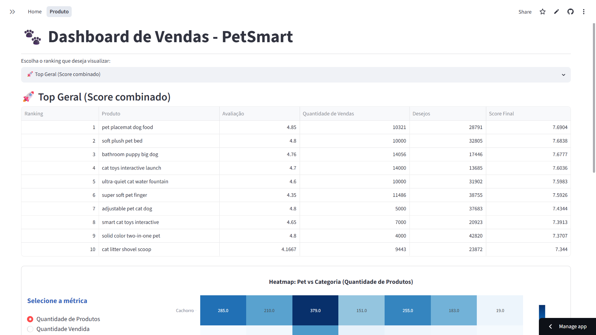
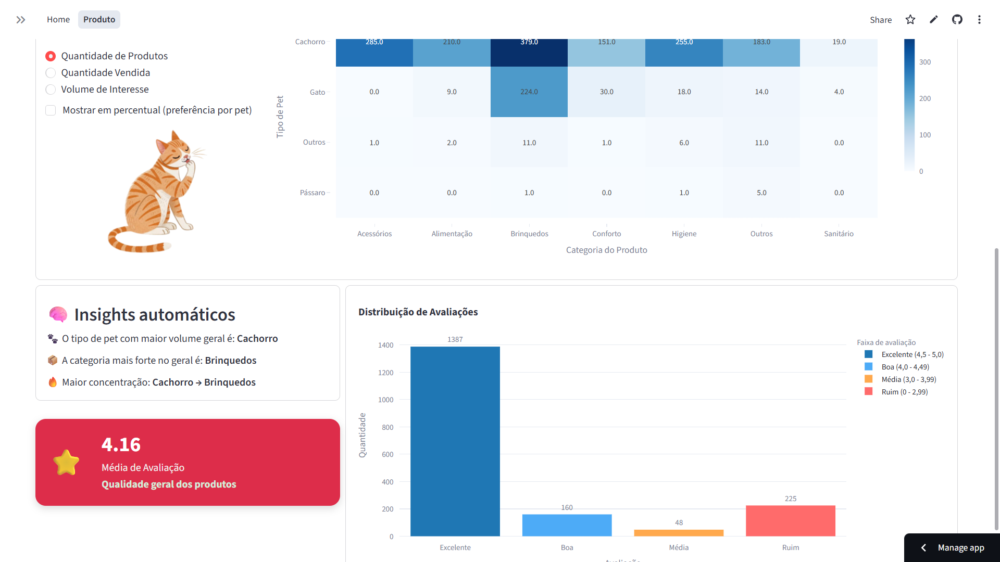

# 🐾 Dashboard de Vendas - PetSmart
🔗 **Acesso:** https://dash-vendas-de-apputos-pet-dz7wmujgwrsrkzpbg8e726.streamlit.app/

➡️ Caso o dashboard esteja inativo, clique em “Run app” para reativar

## 📌 Sobre o Projeto

Este projeto consiste em um dashboard interativo desenvolvido para análise de vendas e gestão de estoque no segmento pet. O objetivo é transformar dados em informações estratégicas que auxiliem na tomada de decisões, permitindo identificar padrões de consumo, oportunidades de crescimento e possíveis gargalos operacionais.

## 🛠️ Tecnologias

🐍 Python | 🗂️ Pandas | 🌐 Streamlit | 📉 Plotly | 🔧 Git | 💻 GitHub

## 📷 Demonstração

  
  

  
  

### Contato

- LinkedIn: www.linkedin.com/in/rayssa-amelia
- GitHub: https://github.com/seu-usuario
